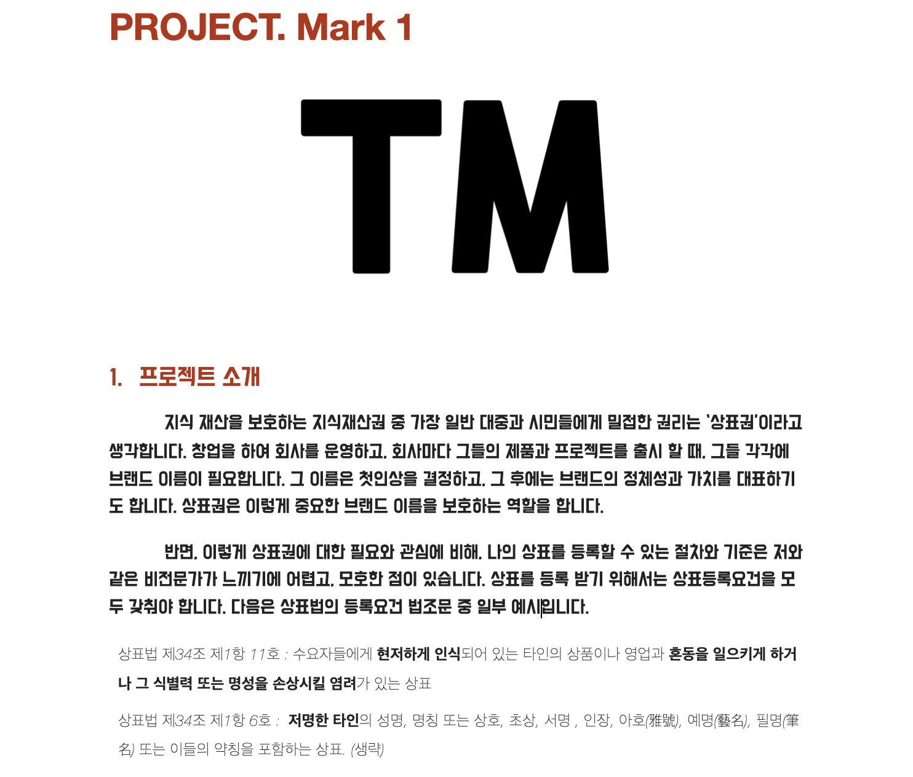
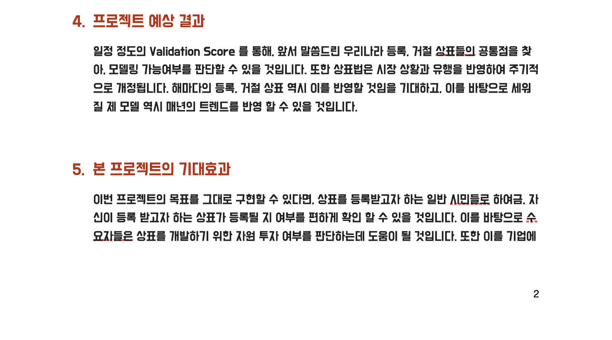

----
## Log
#### 190129
- 데이터 크롤링 시작!
- markinfo.co.kr(robots.txt 확인), kirpris 에서 상표권 이미지 크롤링 예정
- 크롤링 대상
	- 상표 이미지
	- 출원 날짜
	- 현재 상태(출원, 등록, 거절 등)
	- 상품 분류
- 크롤링 진행중 . . .
(190129 19:31 현재 약 152,000개 텍스트 데이터 크롤링 완료)

#### 190130
- 크롤링 1차 완료 (641839 개)
- 이미지 데이터 다운로드 전 data preprocessing
	- 날짜 기준으로 데이터 버림
	- reset indexing
	- 이미지 데이터 셋과, 텍스트 데이터 셋을 넘버링을 맞춰야 하기 때문에, index 가 매우 중요
- 모델링 하기 전 지금의 데이터 숫자(날짜기준으로 데이터 버린후, 83514 개)가 모델링에 충분한 데이터 양인지 질문
- 실제로는 83514 개 보다 좀더 적어질 예정 (train, test split)
- 이미지 url 없는 경우 drop, 8개 drop, 83507
- status
	- 등록, 출원, 공고, 거절, 포기, 취하
	- 등록, 공고 는 같은 카테고리 (상표법 제 57조 제1항, 제 2항)
	- 등록, 공고의 경우 약 40000개
- 크롤링 2차 가동 (이유 : 거르고 난 후 데이터 수 모자르다고 판단, 특히 거절 카테고리 수가 8000개 안팎으로 부족하다고 판단)
